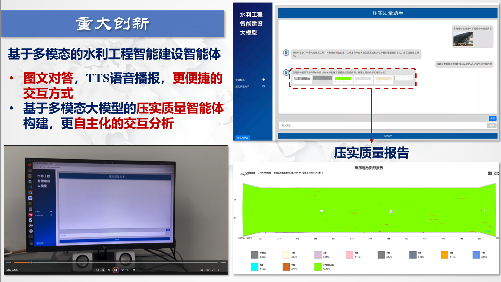
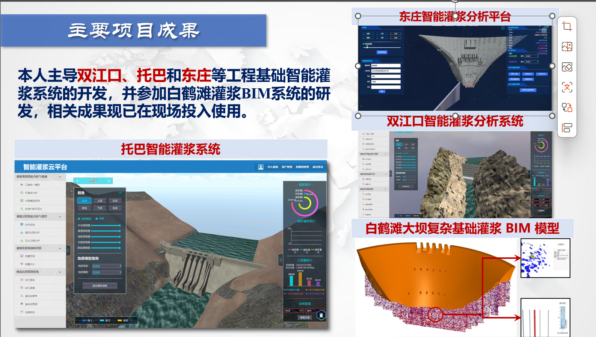
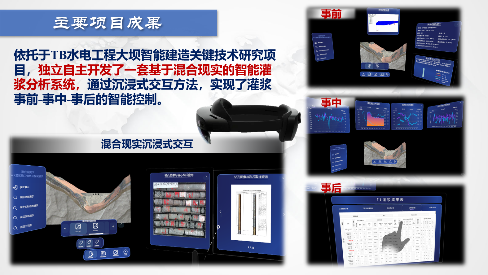

# 项目实现

## 1. 基于大语言模型灌浆知识问答系统

### 视频演示

<video src="./img/grout.mp4" controls width="600"></video>

## 2. 基于多模态的水利工程智能建设智能体

### 视频演示（有语音）

<video src="./img/voice.mp4" controls width="600"></video>

## 3. 双江口、托巴和东庄等工程基础智能灌浆系统的开发，并参加白鹤滩灌浆BIM系统的研发，相关成果现已在现场投入使用。

## 4. 基于Hololens的混合现实交互系统

