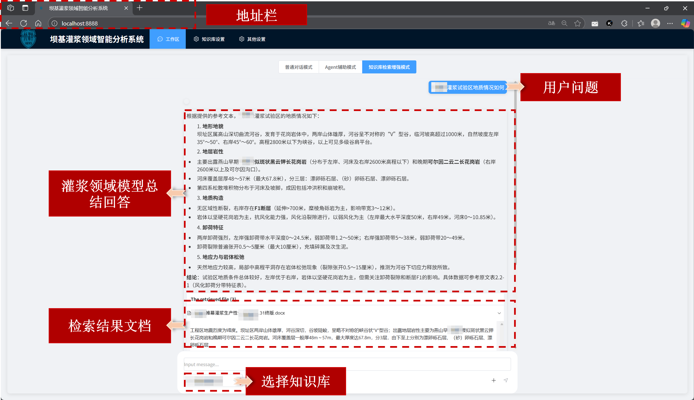
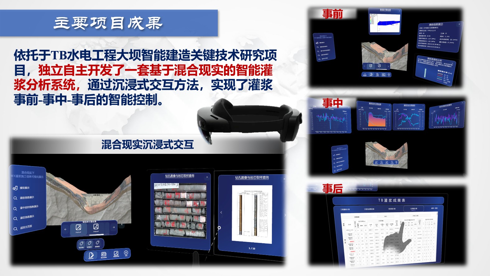

# 项目实现

## 1. 某三甲设计院水保系统前后端开发

### 大屏

## 2. 自制Agent系统研发

### 2.1 整体界面

### 2.2 RAG交互示例

### 2.3 Agent交互

#### 多目标优化模型调用

#### 预测模型调用

#### Text2SQL及自主数据分析

### 3. 自制多端混合现实三维交互系统

## 4. 基于多模态的水利工程智能建设智能体

### 视频演示（有语音）

<video src="./img/voice.mp4" controls width="600"></video>

