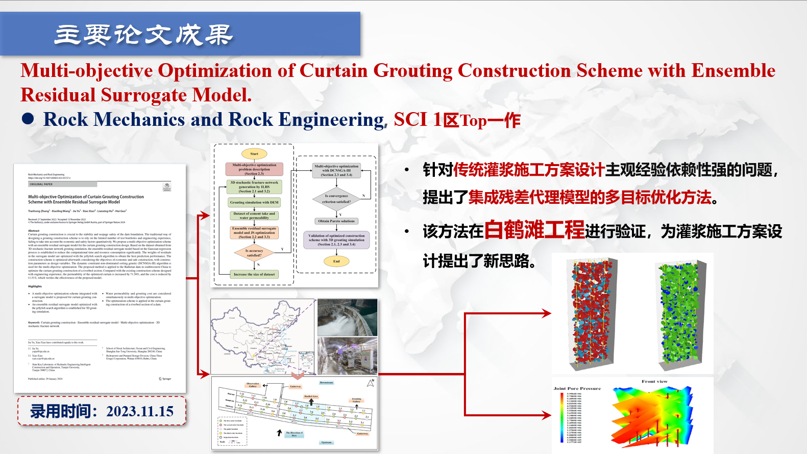
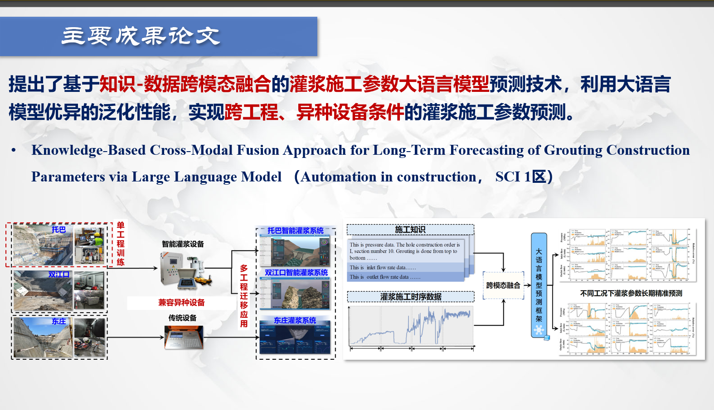
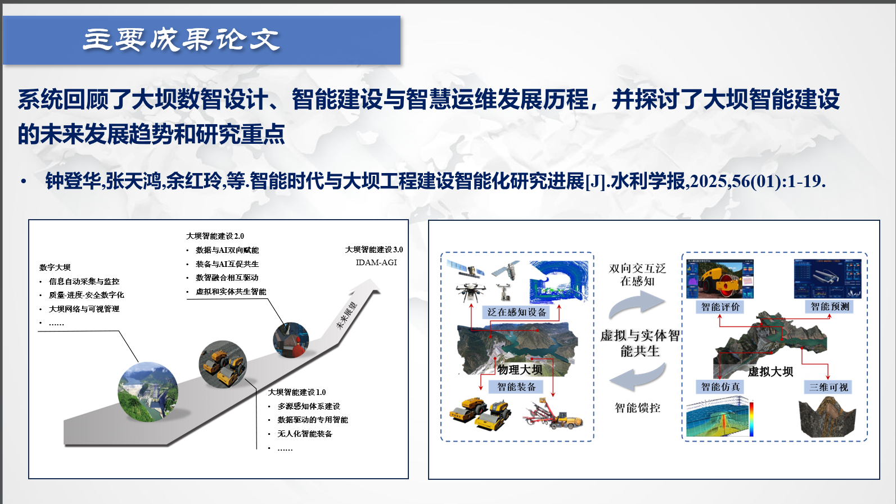

# 论文研究成果

## 1. Multi-objective optimization of curtain grouting construction scheme with ensemble residual surrogate model

- 第一作者，SCI一区TOP 已发表

## 2. Knowledge-based cross-modal fusion for long-term forecasting of grouting construction parameters using large language model

- 第一作者，SCI一区TOP 已发表

## 3. 基于大语言模型的灌浆工程知识服务系统

- 第一作者，EI 已发表

## 4. 智能时代与大坝工程建设智能化研究进展

- 第二作者，EI 已发表

